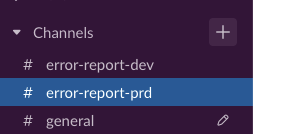
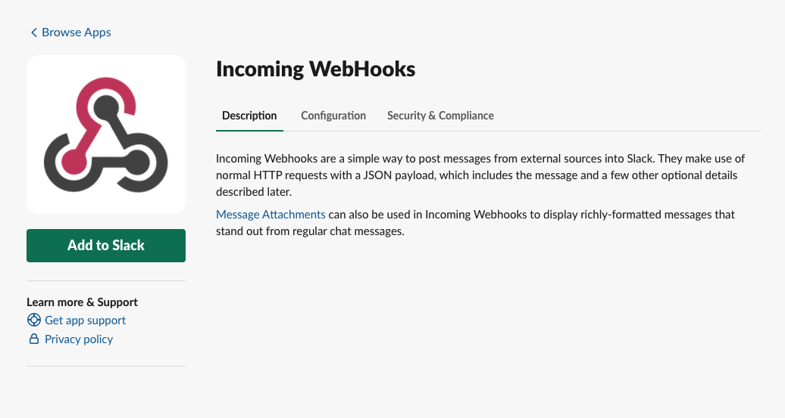
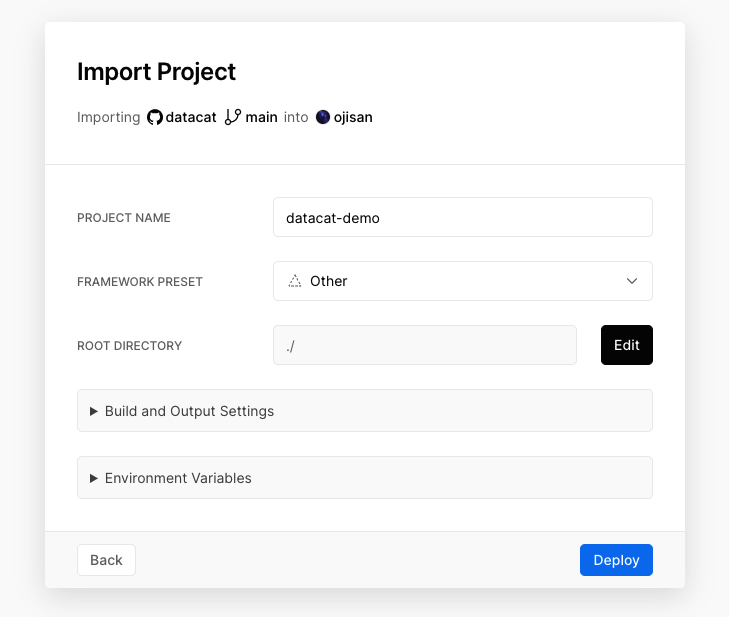

# datacat

For FREE, Error notification tool. This provides you error reporting endpoint. You need just your slack webhook URL and Cloud infrastructure. I recommend Vercel.

(In Japanese, Vercel 経由で Slack に通知を送れるやつ)

## Why free

This app can deploy to Vercel which is free. Of cource, you can deploy ohter infrastrcuture.

## How to use

1. Create slack channel for error loggin.



2. Get webhook url to notify the channel.

Add incoming webhook app extension.

https://${your_slack_name}.slack.com/apps



Connect your channel


3. fork this repository
4. Conect forked repository to Vercel


5. Configure Vercel

Set your slack incoming hook url as Enviroment Varialbes.
datacat send it log.


Project name is important. The name become your error logging endpoint's URL.



After set your project name, click 'Deploy'. You don't need to configure for build and so on. Because Vercel can build TypeScript and construct API without setting, if we use vercel's serverless functions. The detail is [here](https://vercel.com/docs/serverless-functions/introduction).

6. post message to the endpoint

```
 axios
    .post("http://datacat-demo.vercel.app/api/report-dev-error", {
      message: "Hello from vercel!!",
    })
    .then(() => res.status(204).send(""))
    .catch(() => res.status(500).send("slack api error"));
```

or

```
curl -X POST -H "Content-Type: application/json" -d '{"message":"Hello from vercel!!"}' http://datacat-demo.vercel.app/api/report-dev-error
```

and so on.

7. you will get notify in your channel


## Spec

### Endpoint

Host is depends on your deploy.
My example's host is https://datacat.vercel.app

| Endpoint              | Method | Request           |
| --------------------- | ------ | ----------------- |
| /api/report-dev-error | POST   | {message: string} |
| /api/report-prd-error | POST   | {message: string} |

### Enviroment Variables

| Name                  | Description                                                                                                   | required |
| --------------------- | ------------------------------------------------------------------------------------------------------------- | -------- |
| SLACK_WEBHOOK_URL_DEV | Slack Webhook URL for development env                                                                         | x        |
| SLACK_WEBHOOK_URL_PRD | Slack Webhook URL for prd env                                                                                 | o        |
| HOST                  | for cors. this value is for Access-Control-Allow-Origin. If you don't use this, the value is fallback to "\*" | x        |

```

```
